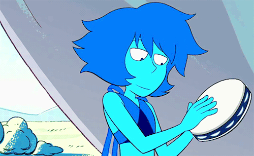

## ˗ˏˋ ★ ˎˊ˗ Lorena Araujo ˗ˏˋ ★ ˎˊ˗

### 🌐 Desenvolvedora WEB |🔧 Técnica de Computadores </h3>

---

### 💻 Melhores Projetos

| Projetos      | Descrição | Link |
|----------------|-----------| ----------|
| **PCI Site** | Site feito para Projetos Consultoria Integrada (Empresa Júnior real) | [Repositório](https://github.com/corvinyy/projetosintegrada) |
| **Casa de Atena - SGEA** | Sistema de gerenciamento de eventos acadêmicos (fictício) | [Repositório](https://github.com/okiobot/SGEA---Casa-de-Atena) |
| **CvinyKey** | Gerador de Senhas com características selecionáveis | [Repositório](https://github.com/corvinyy/password-generator) |
| **Portfólio** | Meu portfólio (desatualizado) | [Repositório](https://github.com/corvinyy/portifolio) |

 

---

### 💡 Sobre mim
  <table>
    <tr>
      <td>
◽️ Olá! Sou a Lorena (Corviny), estudante de Ciência da Computação (UniCEUB), apaixonada por tecnologia e aprendizado contínuo.   
◽️ Tenho interesse especial em desenvolvimento web e em suporte/técnico em informática, e também exploro o desenvolvimento de jogos como um hobby criativo que me permite combinar lógica e imaginação.   
◽️ No GitHub, compartilho meus projetos pessoais e registro o que estou aprendendo à medida que evoluo na área de tecnologia. Estou sempre aberta a colaborações e feedback!   
      </td>
      <td align="right" style="min-width: 180px;">
          
      </td>
      </tr>
  </table>

---

    
    
    
    

---

### 🛠️ Tech Stack

   

    
 

---

### 📊 Estatísticas

  
  
  
 

